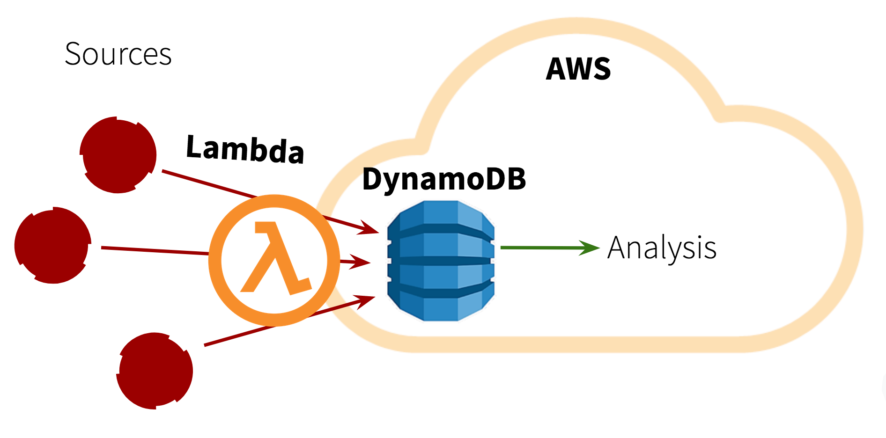
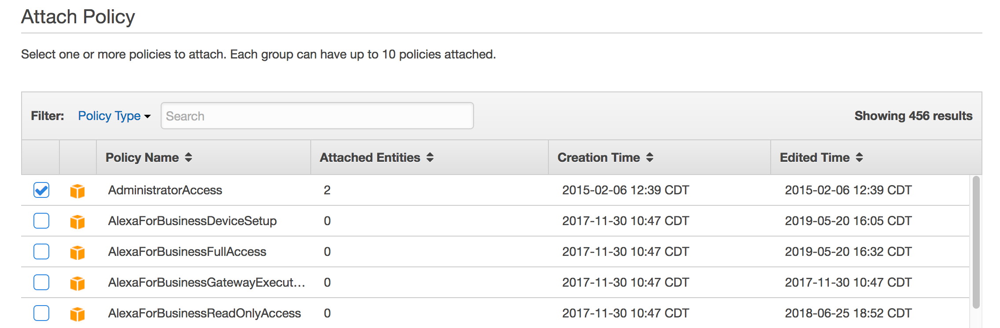
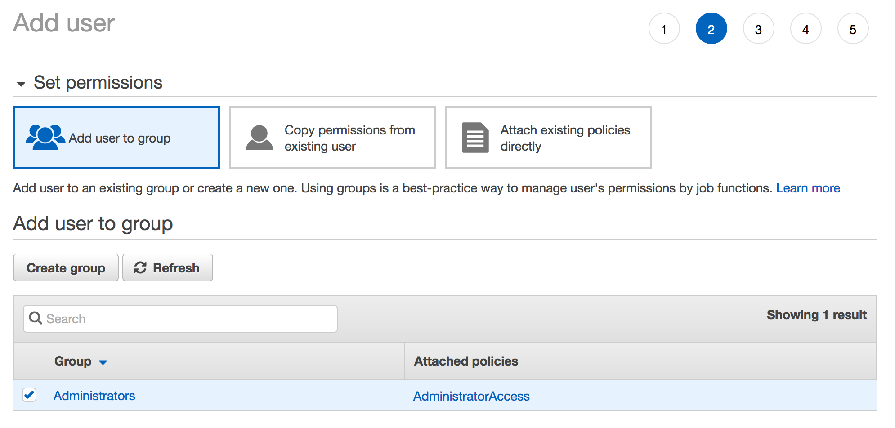
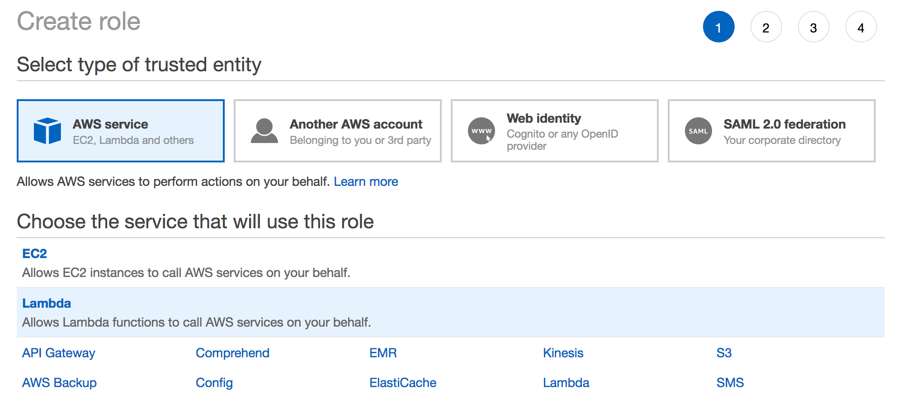
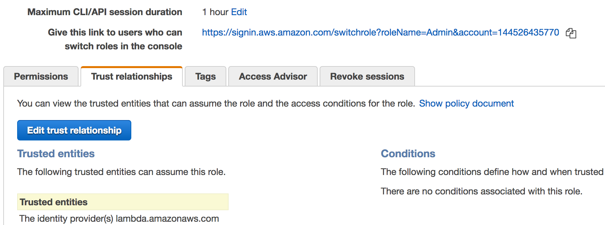
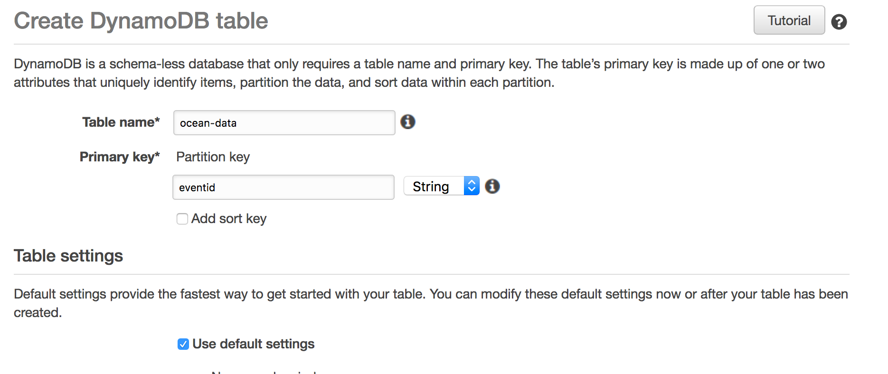
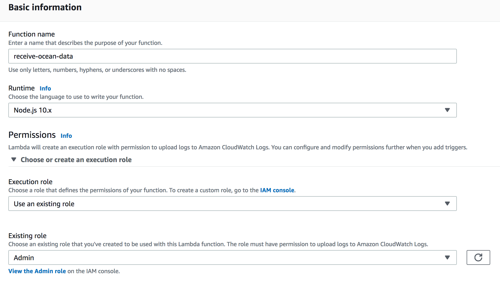
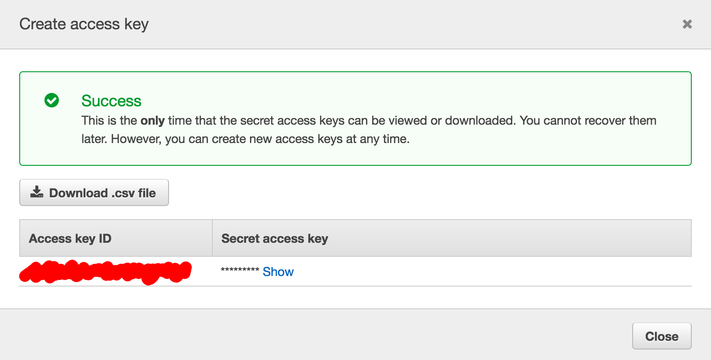

# Data Engineering Demo: Streaming Data to a Lake

> Ahoy, ye sea dogs! I 'ave a problem on me hands. Th' ocean's been changin' on I, makin' life as a good 'n honest pirate hard. Me crew 'n I 'ave distributed a legion o' buoys into th' sea t' measure th' ocean's salinity. But we forgot how t' harvest that data! Arg!!

Hmm, so it seems Captain Scurvy, our client, wants us to find a way to collect ocean salinity data so his crew can analyze it and find out what's wrong with the ocean. Let's help him out!

Captain Scurvy has a bunch of nodes streaming data. Before that data can be analyzed and applied, it first needs to be ingested. So first we need to build a solution for accumulating the captain's data into a single storage area that can be accessed for later analysis. To do this, we will use **AWS** as a cloud platform and store all of his data into a rather primitive **data lake**.



In this diagram, the buoys will stream data into AWS via a Lambda function. The Lambda function will then feed the data into DynamoDB as a text blob. DynamoDB is our data lake, so the data can be stored in its raw form; downstream processes can later consume and analyze the salinity info and possibly find trends.

* We chose a Lambda function since it will only run when invoked and can be invoked by multiple data sources of any kind
* We chose DynamoDB because it is free and good enough for our purposes; S3 is a popular data lake solution also

# Steps

Here you can follow along as we help Captain Scurvy with his big data problem! We will go through the steps below in order to stream data into the cloud.

1. Run buoy to see its output
2. Create an AWS account
3. Create an IAM group and user
4. Create a Role
5. Create a DynamoDB instance
6. Create a Lambda function
7. Download AWS CLI on terminal
8. Config AWS CLI to be your user
9. Check list of functions
10. Run buoy against AWS!

## 1) Run buoy to see its output

First let's see what the data looks like from a typical buoy.

```
node buoy.js
```

The buoy emits an ocean salinity reading every five seconds in a single text string. You should see an output that looks kinda like the following:

```
482285dd237db2b91cb223d91941da4e 2019-07-09T11:33:43.011Z: Cl- 0.5405050501751409, Na+ 0.4645581338738306, Mg2+ 0.052598239716858994, SO24- 0.02790523494214587, Ca2+ 0.010215158080909047, K+ 0.010110872380764295, C 0.0023004302569062554, Br- 0.0008302957264995482, B 0.00041015540200462283, Sr 0.00009003089167608901, F- 0.00006997505377503611
```

Raw data from sources are not always formatted nicely or consistently.

## 2) Create an AWS account

Go **[here](https://aws.amazon.com/free/?all-free-tier.sort-by=item.additionalFields.SortRank&all-free-tier.sort-order=asc)** to register for a free account if you don't already have one. There's only a 12-month free plan, but the solutions we've chosen (Lambda and DynamoDB) are "always free", so you shouldn't see a charge.

Just don't make 1,000,000 calls to your lambda functions, and don't leave your buoy program on by accident!

## 3) Create an IAM group and user

IAM stands for Identity and Access Management. It allows you to control who and what has access to certain AWS resources in your cloud ecosystem. We're gonna use this to create an Admin that has access to everything.

To create a group:

1. Go to the **[AIM Console Panel](https://console.aws.amazon.com/iam)**
2. Go to **Groups** in the left panel.
3. Click on the **Create New Group** button.
4. Give the group a name.
5. Attach the **AdministratorAccess** policy.
6. Confirm!



To create a user:

1. Go to the **[AIM Console Panel](https://console.aws.amazon.com/iam)**
2. Go to **Users** in the left panel.
3. Click on the **Add User** button.
4. Give the user a name of your chosing.
5. Allow Programmatic access.
6. Click **Next:Permissions**.
7. Add the user to the Group you created just now.
8. Tags are optional, so you can skip it and click **Next:Review**
9. Confirm, and the user will be created!



This all creates a user that has full administrator access to all AWS resources. We will use this user on our buoys. _Note that in reality we'd probably be more restrictive in our permissions_.

## 4) Create a Role

Next we will use IAM to create role. Lambdas use roles to determine whether a user has access to a function. So, we need to create the role and attach our user to it.

1. Go to the **[AIM Console Panel](https://console.aws.amazon.com/iam)**
2. Go to **Roles** in the left panel.
3. Click the **Create role** button.
4. Use the default trusted entity, **AWS service**.
5. Under "Choose the service that will use this role", choose **Lambda**, then click Next
6. Attach the **AdministratorAccess** policy and hit Next.
7. Skip the Tags section.
8. Review and confirm the role.



We're not quite done yet. Now we need to assign our admin user to this role we've created.

1. Go to the **Users** tab in the left panel.
2. Click on the user you've created to open up options.
3. Copy the **User ARN**, which uniquely identifies your user.
4. Go to the **Roles** tab in the left panel.
5. Click on the role you've created.
6. Go to the **Trust relationships** tab and click **Edit trust relationship**.
7. Make sure the value in the text box looks like the below. Replace `ARN_NUMBER` with the ARN copied from step 3.

```json
{
  "Version": "2012-10-17",
  "Statement": [
    {
      "Effect": "Allow",
      "Principal": {
        "Service": "lambda.amazonaws.com"
      },
      "Action": "sts:AssumeRole"
    },
    {
      "Effect": "Allow",
      "Principal": {
        "AWS": "ARN_NUMBER"
      },
      "Action": "sts:AssumeRole"
    }
  ]
}
```

8. Confirm by clicking **Update Trust Policy**!



Phew, that was a lot! I promise it gets a little easier.

## 5) Create a DynamoDB instance

Now we need a database within which to store all our data. DynamoDB will be serving as our data lake. It's just a document-based NoSQL database where we can store text blobs.

1. Go to **[DynamoDB Console](https://console.aws.amazon.com/dynamodb/)**.
2. Click **Create table**.
3. Name the table `ocean-data`.
4. Use `eventid` as the **partition key**
 * This is a unique key that DynamoDB uses to index its items
 * We notice in our data string that the first part consists of some device id and a date; that combination must be unique, so we'll use that as our key (eg. `482285dd237db2b91cb223d91941da4e 2019-07-09T11:33:43.011Z`)
5. Click **Create**!



## 6) Create a Lambda function

Time to create our Lambda function! This will take in the raw data from our buoy sources and pump it into the database we just created.

1. Go to **[Lambda Console](https://console.aws.amazon.com/lambda)**
2. Click the **Create function** button.
3. Use **Author from scratch**.
4. Name the function `receive-ocean-data`.
5. Under permissions, you will need to set Execution Role as **Use an existing role**.
6. For the Existing Role field, select the role you created.
7. Click **Create function**.



8. You should now see some kind of panel. Scroll until you see the **Function code** dialog.
9. In here, paste the following code:

```js
var AWS = require('aws-sdk');
var dynamodb = new AWS.DynamoDB({apiVersion: '2012-08-10'});

exports.handler = (event, context, callback) => {
  const tablename = "ocean-data";
  dynamodb.putItem({
    "TableName": tablename,
    "Item" : {
      "eventid": {
        S: event.data.substring(0, 57)
      },
      "data": {
        S: event.data
      }
    }
  }, (err, data) => {
    if (err) {
      console.log(err);
      callback(null, {
        statusCode: "500"
      });
    } else {
      callback(null, {
        statusCode: "204"
      });
    }
  });
};
```

This code puts an item into the database. It uses the first 57 characters as the id, and the entire text is stored into the `data` field. Note the contract between this Lambda and the source devices! The expectation is that data will be received in a `data` field. So, a buoy should send `{ data: "MY_DATA_STRING" }` to the Lambda for the data to be saved.

10. Click **Save** in the top right corner!

## 7) Download AWS CLI on terminal

For simplicity and debugging, we're just gonna interface with AWS using its CLI tool. First, you'll need to make sure you have this installed on your computer. Go **[here](https://docs.aws.amazon.com/cli/latest/userguide/cli-chap-install.html)** for installation instructions. Verify in the terminal that installation succeeded with:

```
aws --version
```

## 8) Config AWS CLI to be your user

To use the Lambda, we need to log into AWS as the user we created. But to do that, we need our user's access keys.

1. Go to the **[AIM Console Panel](https://console.aws.amazon.com/iam)**
2. Go to **Users** in the left panel.
3. Click on the user you created.
4. Go to the **Security credentials** tab.
5. Find Access Keys and click **Create access key**.
6. You will need both access keys shown in the panel. Show the private key so you can copy it into the terminal.



Now it's time to go back to the terminal!

1. Type `aws configure` into the terminal.
2. Paste the public access key.
3. Paste the secret access key.
4. Use json as the default output format.
5. Type in your region. This is important, otherwise you cannot access your Lambda functions!

## 9) Check list of functions

If everything is working, you should be able to verify that the AWS connection works. Simply type in the command below:

```
aws lambda list-functions
```

You should get a non-empty list of functions back. If so, congrats! Yay!! You can move on to Step 10.

If your list is empty, then I'm sorry. Captain Scurvy will punish you with some scurvy.

Odds are something didn't work right. Try troubleshooting against the following issues:

* The User, Group, and Role should have the correct permissions.
* The User should be assigned to the Role.
* Make sure the access keys you've used in Step 8 are correct.
* The region must be correct as well. `us-east-1` and `us-east-2` are different regions!

## 10) Run buoy against AWS!

It is now time to stream data into AWS. Do so with the below command:

```
TO_AWS=true node buoy.js
```

You should see the following message appear every 5 seconds, indicating success:

```
{
    "ExecutedVersion": "$LATEST", 
    "StatusCode": 200
}
```

Try activating multiple buoy instances! They should all be able to stream data into the data lake.

You can verify data has made it into your data lake by going back to the AWS console and checking out the Database.

1. Go to **[DynamoDB Console](https://console.aws.amazon.com/dynamodb/)**.
2. Click **Tables** in the left panel.
3. Click on your `ocean-data` table.
4. Go to the **Items** tab.
5. You should see some items entering the database!

_Now turn off your buoys, or your wallet will be very sad._

# Challenges!

Let's be honest. As magnificent as this tutorial is, it can only get you so far on your learning journey. To truly grow in data engineering, you have to start putting things to practice. So guess what? I'm leaving you with a couple of challenges to try and tackle yourself!

It turns out I made some design mistakes above, and Captain Scurvy isn't very happy with me. Actually, he made me walk the plank, but I survived because I'm awesome like that. Thankfully, he has now turned to you to solve his problems!

## A) Integrate with the Submarine

Captain Scurvy also has a submarine which measures ocean salinity as well as acidity. However, it has a radically different output than the buoys.

```
{"subid":"SS-763","salinity":{"chloride":0.560035712909964,"sodium":0.4835101608520826,"magnesium":0.06062667759174924,"sulfate":0.02322118646249062},"pH":8.110937987926585,"timestamp":1562724669172}
```

Unfortunately, our Lambda function is very specific to the events emitted by the buoys. That is, the `eventid` is the first 57 characters of the data string. For our submarine, that's not very helpful, as the chloride value becomes part of the key.

**Your task is to better engineer the Lambda and Data lake to be more independent of the data source.** The Lambda should only care about ingesting data and putting it into the data lake; it doesn't care about the format of the data.

You can run the submarine against AWS with the following command:

```
TO_AWS=true node submarine.js
```

## B) Testable Lambda Function

So remember that Lambda function we wrote? It isn't tested in any way! I mean, sure, it's simple enough that it's fairly obvious it works by inspection, but what if the Lambda expression needs to become more complicated in the future? Also, can we source control it somehow?

**Your task is to find a way to make the Lambda testable from your local environment**. This will require you to think about how code is deployed from source control to AWS, hopefully improving the extensibility of Captain Scurvy's oceanic endeavours.